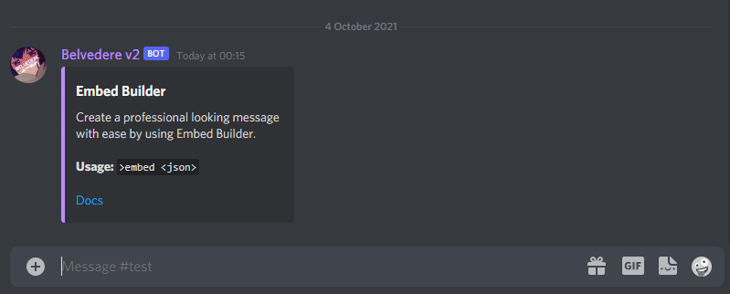
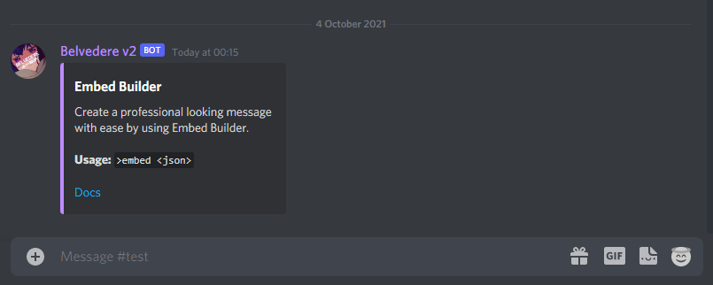
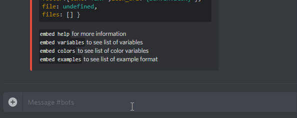

#  [DBM] JSON Embed Builder

Create Proffesional Looking **Embed** on **Discord** using **JSON**

## EXPERIMENTAL 1 FOR VERSION 2.0
Since DBM is still using DiscordJS V12 there are still limitation on things that i can add into
DBM Embed Builder, the current version you're going to install is fully functional for the current
DBM Version you're using.

Once DBM Updated DiscordJS V13 (Discord Bot Maker V1.7 Update), i'll add more features into
DBM Embed Builder.

V2.0 Sneakpeek

# Upcoming Features For **DBM Embed Builder** 2.0
- [x] Lightweight
- [x] Relaxed JSON
- [x] Variables
- [ ] Colors Variables
- [ ] Hex Colors Support
- [ ] Content Message/Plain Text
- [ ] Simplified Thumbnail & Image
- [ ] Docs/Wiki
- [ ] JSON Builder (This will allows you to create Embed JSON in discord)

 
# Installation
Copy [Embed (Raw Data)](https://raw.githubusercontent.com/Gr3nDy/DBM-Embed-Builder/master/RawData/embed.json) and import to
DBM.
* 1.Create New Command
* 2.Right click the command
* 3.Select Edit Raw Data
* 4.Paste [Embed (Raw Data)](https://raw.githubusercontent.com/Gr3nDy/DBM-Embed-Builder/master/RawData/embed.json)
* 5.Click on save
* 6.Install [Dependencies]
* 7.Restart your Bot

# Usages

Commands

* `embed <json>` | Create embed from json

# Depedencies
These are some required Packages in order for it to work:
(_Install package by typing `npm i <package-name>` on your console)
* [really-relaxed-json](https://www.npmjs.com/package/really-relaxed-json)

# Changelogs

1.0.0

* Added `embed help`
* Bugs fixed

1.0.2

* Added `embed variables`
* Added `embed colors`
* Added `embed examples`
* Bugs fixed

1.0.4

* More relaxed JSON
* Thumbnail & Image both works with or without `{url:}`
* Added more colors & variables
* Added `plainText`
* Bugs fixed

1.0.6

+ [1.0.6 (OLDER VERSION)](https://raw.githubusercontent.com/Gr3nDy/DBM-Embed-Builder/master/RawData/embed-1-0-6(old%20version).json)
* Added Random Color `{RANDOM_COLOR}`
* Fixed Invalid `\` When creating new line
* Fixed Invalid `\` When inserting double quotes

1.0.8

+ [1.0.8 (LATEST VERSION)](https://raw.githubusercontent.com/Gr3nDy/DBM-Embed-Builder/master/RawData/embed.json)
* Added `ALIASES` (Now it's easier to post an embed)
* Ability to change `ALIASES` Prefix
* Bugs fixed

# Note
⚠️<b>Make sure you've installed <em>DBM Mods</em> on your DBM</b>⚠️ 
 
 
<<<<<<< HEAD
If you like to use an online generator for json embed builder you can use:
[Nadeko Embed Builder](https://eb.nadeko.bot) (Plaintext, thumbnail, image isn't working anymore on experimental version, will probably be updated on experimental 2)
=======
If you like to use an online generator for json embed builder you can use; [Nadeko Embed Builder](https://eb.nadeko.bot) (Plaintext isn't working anymore on experimental version)
>>>>>>> a39e7aa8a0cdc8ebbf7ff781b25695c433072887
 
Heres a few guides that might come in handy:
[Embeds|Discord.js](http://discordjs.guide/popular-topics/embeds.html)
 
 
With **DBM Embed Builder** You don't have to use `curly brackets`/`{ }` on the first and the last letter of the message, however
you still can use them if you want to.

Showcase

 
 
 
Add this repo to your bookmark if you wanna see new update, simply just click on the star
on top right corner.
