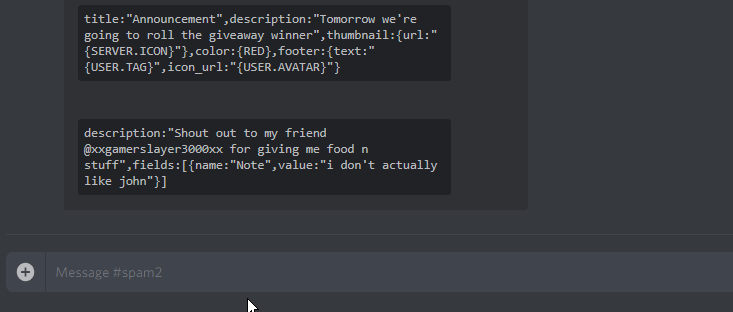

#  [DBM] Embed Builder

Create **Embed** inside **Discord**

 
# Installation
Copy [Embed (Raw Data)](https://raw.githubusercontent.com/Gr3nDy/DBM-Embed-Builder/master/RawData/embed.json) and import to
DBM.
* 1.Create New Command
* 2.Right click the command
* 3.Select Edit Raw Data
* 4.Paste [Embed (Raw Data)](https://raw.githubusercontent.com/Gr3nDy/DBM-Embed-Builder/master/RawData/embed.json)
* 5.Click on save

# Features

Commands

* `embed <embed>` | Create embed from json
* `embed help <1/2/3/4/5>` | Embed Builder guide
* `embed variables` | List of variables
* `embed colors` | List of color variables
* `embed examples` | List of example format

# Changelogs

1.1.1

* Added `embed help`
* Bugs fixed

1.2.5

* Added `embed variables`
* Added `embed colors`
* Added `embed examples`
* Bugs fixed

1.7.2

* More relaxed JSON
* Thumbnail & Image both works with or without `{url:}`
* Added more colors & variables
* Bugs fixed

# Note
If you like to use an online generator for json embed builder you can use; [Nadeko Embed Builder](https://eb.nadeko.bot)
